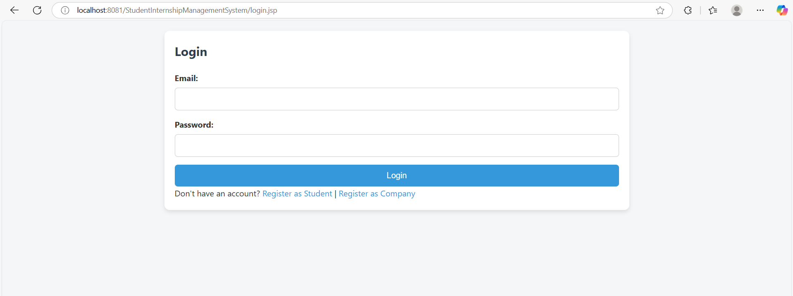
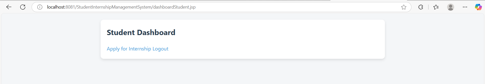
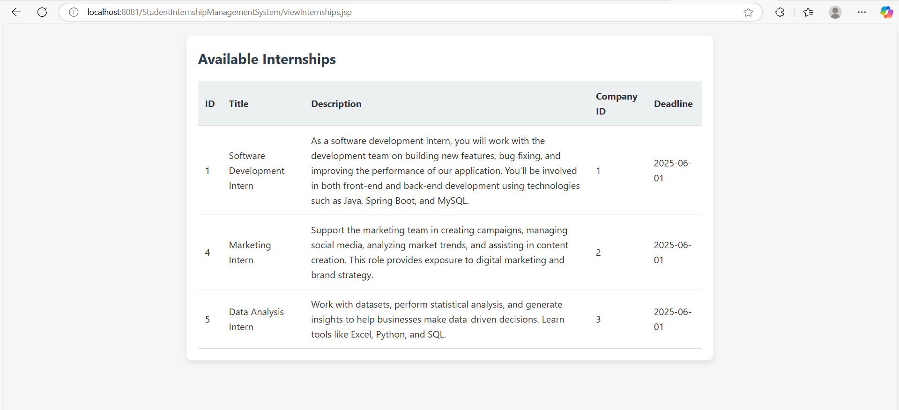
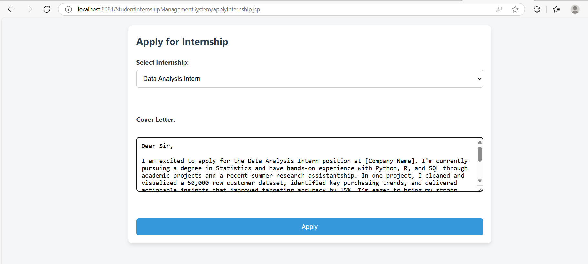
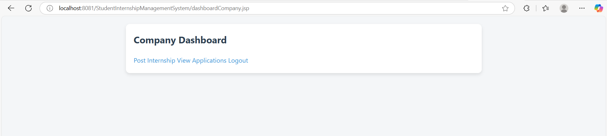
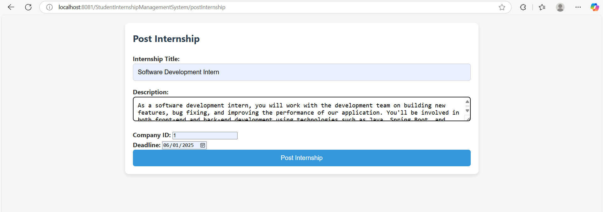
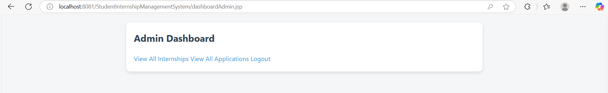

# 🎓 Student Internship Management System

A Java EE-based web application designed to manage student internships efficiently. The system supports multiple roles—students, companies, and administrators—each with its own dashboard and functionality.

---

## 📸 Screenshots

### 🔐 Login Page


### 🏠 Student Dashboard


### 🧾 Internship Listings


### 📝 Apply Internship


### 🏢 Company Dashboard


### 🗂️ Post Internship


### ⚙️ Admin Dashboard


---

## 🧰 Tech Stack

- **Java EE** (Servlets, JSP)
- **JDBC** – MySQL Connectivity
- **MySQL** – Relational Database
- **HTML/CSS/JavaScript** – Front-end
- **Apache Tomcat** – Deployment
- **NetBeans IDE**

---

## ✨ Features

### 👨‍🎓 Students
- Register/Login
- View available internships
- Apply to internships
- View their applications

### 🏢 Companies
- Register/Login
- Post internship opportunities
- View applications from students

### 🛡️ Admin
- Manage users (students & companies)
- Approve or reject internships
- View system statistics

---

## 📁 Project Structure
StudentInternshipManagementSystem/
│
├── Web Pages/
│ ├── META-INF/
│ ├── WEB-INF/
│ ├── ajax/
│ ├── css/
│ │ └── styles.css
│ ├── js/
│ │ └── validations.js
│ ├── index.jsp
│ ├── login.jsp
│ ├── registerStudent.jsp
│ ├── registerCompany.jsp
│ ├── dashboardStudent.jsp
│ ├── dashboardCompany.jsp
│ ├── dashboardAdmin.jsp
│ ├── postInternship.jsp
│ ├── applyInternship.jsp
│ ├── viewInternships.jsp
│ └── viewApplications.jsp
│
├── Source Packages/
│ ├── controller/
│ │ ├── ApplicationServlet.java
│ │ ├── InternshipServlet.java
│ │ ├── LoginServlet.java
│ │ ├── LogoutServlet.java
│ │ └── RegisterServlet.java
│ ├── controller.filter/
│ │ └── AuthFilter.java
│ ├── dao/
│ │ ├── ApplicationDAO.java
│ │ ├── InternshipDAO.java
│ │ └── UserDAO.java
│ ├── model/
│ │ ├── Application.java
│ │ ├── Internship.java
│ │ └── User.java
│ └── util/
│ └── DBConnection.java


---

## ⚙️ Setup Instructions

### 🔸 Prerequisites
- NetBeans IDE (preferably with Java EE support)
- Apache Tomcat (8.5+)
- MySQL Server
- Git

### 🔹 Steps
---

### 1. **Clone the Repository**

If you haven’t already, open Git Bash or terminal and run:

```bash
git clone https://github.com/fihaasac/Student-Internship-Management-System.git
```

---

### 2. **Open the Project in NetBeans**

* Launch **NetBeans IDE**.
* Go to **File → Open Project**.
* Browse to the folder where you cloned the repo.
* Select the `StudentInternshipManagementSystem` project and open it.

---

### 3. **Create MySQL Database**

* Open **phpMyAdmin** or any MySQL client.
* Create a new database:

```sql
CREATE DATABASE internship_db;
```

> 🔧 Make sure the database name in your code (in `DBConnection.java`) matches this name.

---

### 4. **Create Required Tables**

Run the following SQL to create basic tables:

```sql


-- APPLICATIONS table
CREATE TABLE `applications` (
  `id` int(11) NOT NULL,
  `internship_id` int(11) NOT NULL,
  `student_id` int(11) NOT NULL,
  `status` enum('Pending','Approved','Rejected') DEFAULT 'Pending',
  `cover_letter` text DEFAULT NULL
);

-- INTERNSHIPS table
CREATE TABLE `internships` (
  `id` int(11) NOT NULL,
  `title` varchar(100) NOT NULL,
  `description` text NOT NULL,
  `company_id` int(11) NOT NULL,
  `deadline` date NOT NULL
);

-- USERS table
CREATE TABLE `users` (
  `user_id` int(11) NOT NULL,
  `name` varchar(100) NOT NULL,
  `email` varchar(100) NOT NULL,
  `password` varchar(100) NOT NULL,
  `role` enum('Student','Company','Admin') NOT NULL
);

INSERT INTO `users` (`user_id`, `name`, `email`, `password`, `role`) VALUES
(1, 'Admin User', 'admin@internship.com', 'admin123', 'Admin'),
(2, 'Student User', 'student@domain.com', 'student123', 'Student'),
(3, 'Company User', 'company@company.com', 'company123', 'Company');

---

### 5. **Update `DBConnection.java`**

Go to:
`Source Packages → util → DBConnection.java`

Update the database credentials:

```java
private static final String URL = "jdbc:mysql://localhost:3306/internship_db";
private static final String USERNAME = "root"; // your MySQL username
private static final String PASSWORD = "";     // your MySQL password
```

---

### 6. **Set Up Server (Apache Tomcat)**

* In NetBeans, go to **Services → Servers**.
* If Apache Tomcat is not added:

  * Right-click → Add Server
  * Choose **Apache Tomcat**, set path, and configure.
* Right-click your project → **Properties → Run**.

  * Select your server (Tomcat) and make sure context path is `/StudentInternshipManagementSystem`.

---

### 7. **Build and Deploy**

* Right-click the project → **Clean and Build**.
* Then, right-click again → **Run**.
* The system will open in your browser, typically at:
  `http://localhost:8080/StudentInternshipManagementSystem/`

---

### 8. **Login Info (Optional)**

You can manually insert initial users via phpMyAdmin for testing:

```sql
-- Admin
INSERT INTO users (name, email, password, role)
VALUES ('Admin', 'admin@example.com', 'admin123', 'admin');

-- Student
INSERT INTO users (name, email, password, role)
VALUES ('Student', 'student@example.com', 'student123', 'student');

-- Company
INSERT INTO users (name, email, password, role)
VALUES ('Company', 'company@example.com', 'company123', 'company');

---

